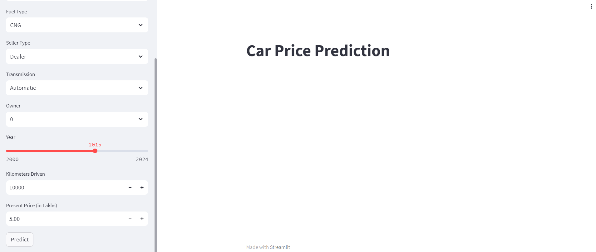
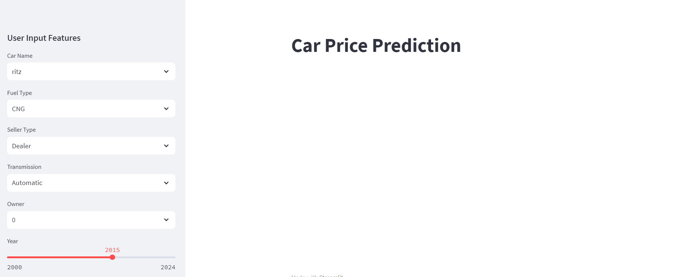
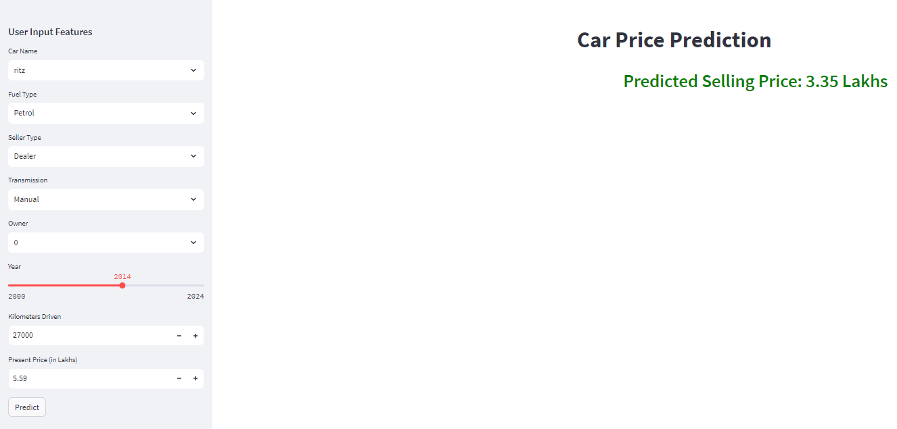

# Car Price Predictor

This repository contains a Car Price Prediction application built using Streamlit and Scikit-Learn. The application predicts the selling price of a car based on various input features provided by the user.

## Overview

The Car Price Predictor is a web application that allows users to input details about a car and receive a predicted selling price. The prediction is made using a machine learning model trained on historical car data.

## Features

- Predict car selling prices based on user inputs.
- User-friendly GUI built with Streamlit.
- Handles categorical and numerical features.
- Displays predictions in a clean and readable format.

## Screenshots

### Dashboard GUI


### Input GUI


### Output


## Installation

To run this project locally, follow these steps:

1. **Clone the repository:**

   ```bash
   git clone https://github.com/expoashish/Car_Price_Predictor.git
   cd Car_Price_Predictor

2. **Running the Application**
  Ensure the CSV file car_prediction_data.csv is in the project directory.

Run the Streamlit application:
  streamlit run app.py
  
Open your web browser and go to:
  http://localhost:8501
3. **Project Structure**
app.py: Main file to run the Streamlit application.
model.py: Contains functions for loading data, preprocessing, and training the model.
car_prediction_data.csv: Dataset used for training the model.
requirements.txt: List of required Python packages.
4. **Usage**
Select the car's details using the provided dropdown menus and input fields on the sidebar.
Click the "Predict" button to see the predicted selling price of the car displayed on the main page.
